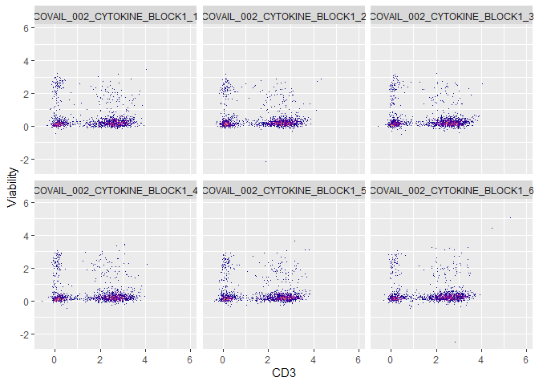
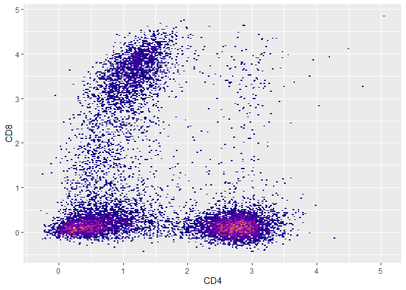
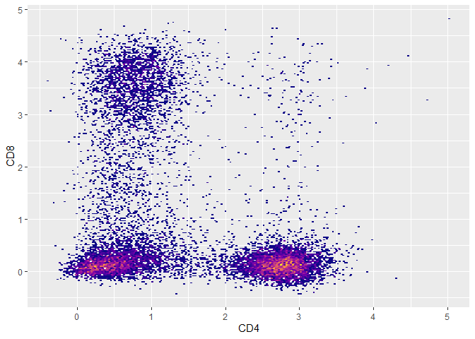

<!-- README.md is generated from README.Rmd. Please edit that file -->

# flowstate

<!-- badges: start -->

<!-- badges: end -->

`flowstate` provides a system for processing, analyzing, and visualizing
Flow Cytometry Standard (FCS) data.

The primary features of `flowstate`:

- Read and parse .fcs files as flowstate objects (S3)
- Perform spectral unmixing (Full Spectrum Cytometry/Spectral Cytometry)
- Perform spillover compensation/correction
- Transform expression values (MFI/ion counts)
- Visualize primary data
- Write FCS version 3.1 compliant files

## Installation

You can install the development version of flowstate from
[GitHub](https://github.com/) with:

``` r
# install.packages("pak")
pak::pak("nlaniewski/flowstate")
```

## `flowstate` Generalized Workflow

Paths to previously acquired .fcs files:

``` r
fcs.file.paths <- system.file("extdata", package = "flowstate") |>
  list.files(full.names = TRUE, pattern = "BLOCK.*.fcs")
```

Read/concatenate:

``` r
fs <- flowstate::read.flowstate(fcs.file.paths,colnames.type = "S",concatenate = TRUE)
#> COVAIL_002_CYTOKINE_BLOCK1_1.fcs --> flowstate
#> COVAIL_002_CYTOKINE_BLOCK1_2.fcs --> flowstate
#> COVAIL_002_CYTOKINE_BLOCK1_3.fcs --> flowstate
#> COVAIL_002_CYTOKINE_BLOCK1_4.fcs --> flowstate
#> COVAIL_002_CYTOKINE_BLOCK1_5.fcs --> flowstate
#> COVAIL_002_CYTOKINE_BLOCK1_6.fcs --> flowstate
#> Concatenating 'flowstate.ojects'...
```

Transform:

``` r
flowstate::flowstate.transform(fs,transform.type = 'asinh',cofactor = 5000)
#> flowstate.object --> transforming...
```

Visualize:

``` r
plot(fs,CD3,Viability) + ggplot2::guides(fill = 'none') + ggplot2::facet_wrap(~sample.id)
```



``` r
##needs compensation correction
plot(fs,CD4,CD8) + ggplot2::guides(fill = 'none')
```



``` r
##update [['spill']] with a correction value
flowstate::spillover.update.value(fs,CD8,CD4,0.03)
##apply spillover correction
flowstate::spillover.apply(fs)
#> flowstate.object --> transforming...
##compensated data
plot(fs,CD4,CD8) + ggplot2::guides(fill = 'none')
```


